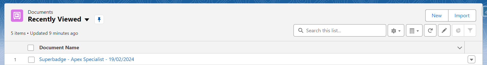
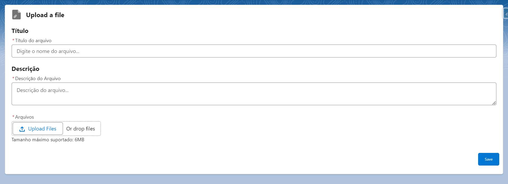
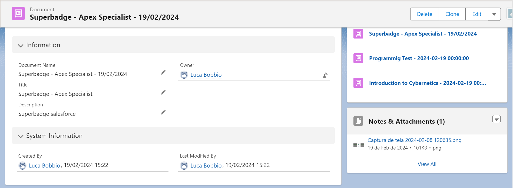

# Upload Files with LWC - Salesforce DX Project

Simples projeto realizado e desenvolvido no CRM Salesforce onde foi desenvolvido a funcionalidade de upload de arquivos a partir de uma tela customizada feita com Lightning Web Components e uma classe Apex.

## Componente de Lightning Web Components

- UploadFiles: Único componente que incorpora a funcionalidade de realizar um upload de arquivo, além de criar um registro do objeto Document__c referente aquele arquivo.

## Componente Aura

- CallUploadFiles: Componente aura que é usado no quick action `New` da página do objeto Document__c. Possui a funcionalidade de chamar e renderizar a página composta pelo componente UploadFiles.

## Classe Apex

- UploadFilesController: Classe controller do componente LWC UploadFiles. Possui métodos que criam registros dos objetos Document__c, ContentVersion, ContentDocument e ContentDocumentLink.

## Visualização da Página Customizada

Tela `list view` do objeto Document__c

Página principal composta pelo componente UploadFiles LWC

Página de Registro do Objeto Document__c
